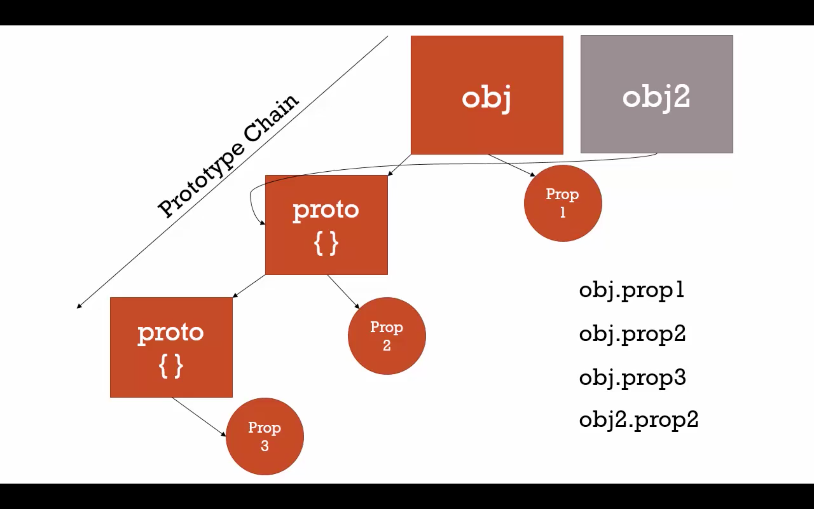

# JavaScript Object Oriented Programming

Object oriented programming is a prevalent paradigm in JavaScript programming

## Fundamental premises of OOP

1. [Encapsulation](#encapsulation)
2. [Inheritance](#inheritance)
3. [Polymorphism](#polymorphism)

## Encapsulation
- Encapsulation is a fundamental premise of OOP
- Encapsulation dictates that all the data and functionality that is necessary to represent an object should be collected together within an object and its inner workings hidden from the outside world that might need to use that object
- Properties and methods are central to encapsulation, but so is controlling the access to those properties and methods

### Encapsulation in code

1. The Problem

``` js
var person = {
  fullName : "Jason Shapiro",
};

alert(person.fullName); // Jason Shapiro
person.fullName = "Jim White";
alert(person.fullName); // Jim White
```

BUT, the data is mutable and accessible from outside scope/world

``` js
person.fullName = 42;
alert(person.fullName); // 42
```

2. Incomplete Solution

```js
var person = {
  fullName : "Jason Shapiro",
  setFullName : function (newValue) {
    var reg = new RegExp(/\d+/);
    if( reg.test(newValue) ) {
      alert("Invalid Name");
    }
    else {
      this.fullName = newValue;
    }
  },
  "getFullName" : function() {
    return this.fullName;
  }
};

alert( person.getFullName() );   // Jason Shapiro
person.setFullName( "Jim White" );
alert( person.getFullName() );   // Jim White
person.setFullName( 42 );        // Invalid Name
alert( person.getFullName() );   // Jim White
```

BUT. When the caller calls “setFullName” it ensures the name doesn’t contain a digit.  But unfortunately, we’re only half way there.  This strategy requires a wink and a nod from the caller ensuring that they promise not to call “fullName” directly.  The code as written, however, won’t stop them from breaking this informal contract:

```js
person.setFullName( 42 ); // Invalid Name; the name is not changed.
person.fullName = 42;     // No validation is executed; the name is changed and...
alert( person.getFullName() );   // ...42 is printed.
```

3. Better Approach with Closures

```js
var person = function () {

  var fullName = "Jason Shapiro";
  var reg = new RegExp(/\d+/);

  var theObj = {
    setFullName : function (newValue) {
      if( reg.test(newValue) ) {
        alert("invalid name");
      }
      else {
        fullName = newValue; // Legal! The object has access to "fullName"
      }
    },
    getFullName : function () {
     return fullName; // Legal! The object has access to "fullName"
    }
  }; // End of the Object
};
person.getFullName(); // doesn't work!
```

Here we have a function which is hiding the fullName variable from the outside world.  The inner object (theObj), however, can access fullName.

BUT. We’re getting closer!  We’ve created an anonymous function to hide the variables, and then defined the object as an inner object, in order to grant it access to the private variables.  But how do we expose the inner object to the outside world? 

4. Complete Solution

```js
var person = function () {

  var fullName = "Jason Shapiro";
  var reg = new RegExp(/\d+/);

  return { 
    setFullName : function (newValue) {
      if( reg.test(newValue) ) {
        alert("Invalid Name");
      }
      else {
        fullName = newValue;
      }
    },
    getFullName : function () {
     return fullName; 
    }
  }; // end of the return
}(); // Note the '()', this means we're calling the function 
     // and assigning the *returned object,* instead of 
     // the *function itself* for the value of 'person.'

alert(person.getFullName());   // Jason Shapiro
person.setFullName( "Jim White" );
alert(person.getFullName());  // Jim White
person.setFullName( 42 ); // Invalid Name; the name is not changed.
person.fullName = 42;     // Doesn't affect the private fullName variable.
alert(person.getFullName());  // Jim White is printed again.
```

The trick is to remember to call the anonymous function immediately after its definition, and assign the return value (the inner object) to the outside variable (person), rather than simply assigning the anonymous function itself to the outside variable.  This is done by using the invocation operator, (), at the end of the function.  Since this is easy to miss, and we want to strive for maximum readability, developers typically wrap the entire anonymous function & invocation operator with parentheses.  While this isn’t required, it’s definitely recommended as a way to signal to other developers, “this function is being executed rather than simply assigned.”

## Inheritance

- One object gets access to the properties and methods of another object. 
- Inheritance is the idea that new types of objects can be derived from existing types of objects, inheriting all of their properties and methods

*In common English, Inheritance means one object could access to the properties and methods of other objects. It is there in C, Java, python, etc. It also known as classical inheritance*

### Clasical Inheritance

Most popular OOP languages use **classical inheritance**

- Each individual object is instantiated from a class 
- Classes act as a templates for producing initially identical instances which can typically be customized as or after they are created
- New classes can be defined as **subclasses** of other classes, in which case the subclass **inherits** the properties and methods of the **superclass** 
- - The subclass then has the option to override its inherited properties and methods or add more of its own
- - This is classical inheritance
- Classical inheritance can result in extensive and potentially convoluted hierarchies of interrelated classes and objects

#### **[Sample Classical Inheritance JavaScript - oop_sample1.js](./oop_sample1.js)**

**NOTICE**
- **EcmaScript6/ES6/ES2015** does support classical inheritance constructs
- JavaScript has historically used a different style of inheritance known as **prototypal inheritance**. Since that’s what underlies even the newer ES6 classical inheritance-style constructs

### Prototypal Inheritance

*JavaScript is a bit confusing for developers experienced in class-based languages (like Java or C++), as it is dynamic and does not provide a class implementation per se (the class keyword is introduced in ES2015, but is syntactical sugar, JavaScript remains prototype-based).*

JavaScript has historically used a different style of inheritance known as prototypal inheritance

Under prototypal inheritance, objects are based upon prototypes rather than classes
- All objects, including functions, have a hidden **prototype** property that is simply an object (with its own properties and methods)
- Within the context of this *prototype* property, the *this* keyword always contains a reference to the object instance that owns that prototype
- When we try to access a property or method of an object that isn’t that object’s own property or method, JavaScript looks for it in the object’s **prototype** object
- - ***But since the prototype is just an object, it can have a prototype property of its own; so if the property or method can’t be found in the prototype, JavaScript looks in the prototype’s prototype, and so on
- - This results in a **prototype chain**, which is similar to (but not the same as) the scope chain***


#### Prototype Chain
Nearly all objects in JavaScript are instances of Object which sits on the top of a prototype chain.

- Properties and methods that exist anywhere along an object’s prototype chain can be accessed as if they were part of that object
- JavaScript objects have a link to a prototype object. When trying to access a property of an object, the property will not only be sought on the object but on the prototype of the object, the prototype of the prototype, and so on until either a property with a matching name is found or the end of the prototype chain is reached
- Eventually, all prototype chains end with the **base object**, which is the only JavaScript object that has no prototype
- The base object is represented by the **Object()** constructor function. Or, in other words, an object inherits all the properties and methods of all the prototype objects in its prototype chain
- Furthermore, multiple objects can share the same prototype, and therefore the same prototype chain
- That’s prototypal inheritance (Brain exploded yet? Welcome to JavaScript, the weird parts!)


*JavaScript - The Weird Parts Udemy*

##### Inheriting Properties
Sample of trying to access a property:
```js
// Let's create an object o from function f with its own properties a and b:
let f = function () {
   this.a = 1;
   this.b = 2;
}
let o = new f(); // {a: 1, b: 2}

//add properties in f function's prototype
 f.prototype.b = 3;
 f.prototype.c = 4;

// do not set the prototype f.prototype = {b:3,c:4}; this will break the prototype chain
// o.[[Prototype]] has properties b and c.
// o.[[Prototype]].[[Prototype]] is Object.prototype.
// Finally, o.[[Prototype]].[[Prototype]].[[Prototype]] is null.
// This is the end of the prototype chain, as null,
// by definition, has no [[Prototype]].
// Thus, the full prototype chain looks like:
// {a: 1, b: 2} ---> {b: 3, c: 4} ---> Object.prototype ---> null

console.log(o.a); // 1
// Is there an 'a' own property on o? Yes, and its value is 1.

console.log(o.b); // 2
// Is there a 'b' own property on o? Yes, and its value is 2.
// The prototype also has a 'b' property, but it's not visited. 
// This is called "property shadowing."

console.log(o.c); // 4
// Is there a 'c' own property on o? No, check its prototype.
// Is there a 'c' own property on o.[[Prototype]]? Yes, its value is 4.

console.log(o.d); // undefined
// Is there a 'd' own property on o? No, check its prototype.
// Is there a 'd' own property on o.[[Prototype]]? No, check its prototype.
// o.[[Prototype]].[[Prototype]] is null, stop searching,
// no property found, return undefined.
```

##### Inheriting Methods

- JavaScript does not have "methods" in the form that class-based languages define them. In JavaScript, any function can be added to an object in the form of a property. An inherited function acts just as any other property

Sample of inheriting methods:
```js
var o = {
  a: 2,
  m: function() {
    return this.a + 1;
  }
};

console.log(o.m()); // 3
// When calling o.m in this case, 'this' refers to o

var p = Object.create(o);
// p is an object that inherits from o

p.a = 4; // creates a property 'a' on p
console.log(p.m()); // 5
// when p.m is called, 'this' refers to p.
// So when p inherits the function m of o, 
// 'this.a' means p.a, the property 'a' of p
```

#### Why prototypal inheritance?
1. Simple
2. Flexible
3. Extensible
4. Easy to understand

#### Base Object
*Everything in JavaScript has a prototype, except the base object*

- Bottom of the prototype chain
- Base object: Object{}

```js
var a = {};
var b = function() { };
var c = [];

a.__proto__ // Object{}
a.__proto__.__defineGetter__ // object methods of base built-in objects
b.__proto__ // function Empty() {}
b.__proto__.__defineGetter__ // func methods of base built-in objects
c.__proto__ // []
c.__proto__.__defineGetter__ // array methods of base built-in objects
// fun part
c.__proto__.__proto__ // object {}, you get down to the base - bottom of prototype chain, the base does not have proto
```

#### **[Sample Prototypal Inheritance JavaScript - prototypal_inheritance_sample1.js](./prototypal_inheritance_sample1.js)**

## Polymorphism

- Polymorphism is the idea that objects of different types may have identically named methods that provide similar functionality but may be implemented in different ways

## Reference

- JavaScript The Weird Parts - Udemy
- [Mozilla Developer - JavaScript, Inheritance vs Prototype Chain](https://developer.mozilla.org/en-US/docs/Web/JavaScript/Inheritance_and_the_prototype_chain)
- [Encapsulation in JavaScript by Jason Shapiro](https://www.intertech.com/Blog/encapsulation-in-javascript/)